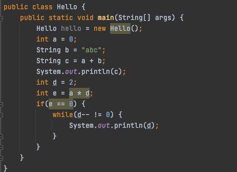
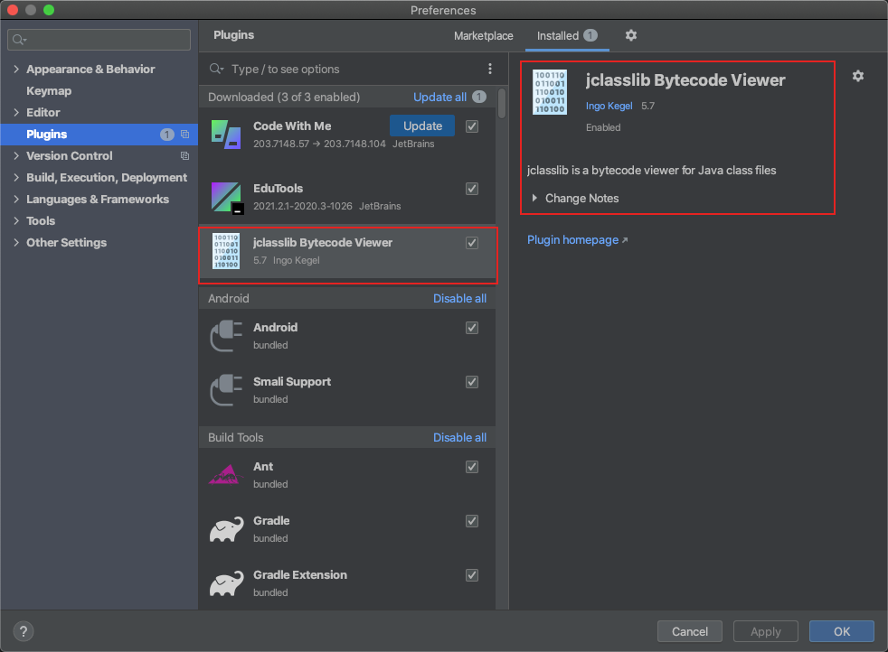
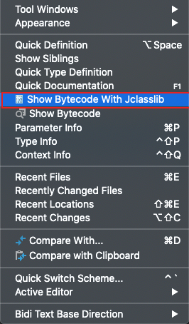
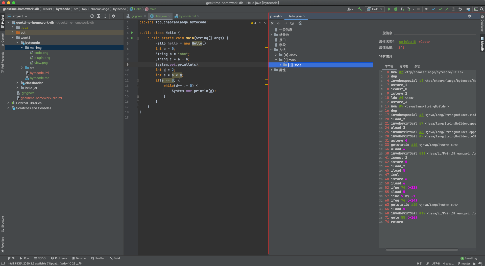

# ByteCode练习

## 要求

写一个简单的 Hello.java，里面需要涉及基本类型，四则运行，if 和 for，然后自己分析一下对应的字节码

## Hello.java



## 命令

*这个命令会直接将class文件生成到当前java文件存放的目录下*
*导致IDEA的工具会找不到对应的class文件，所以没办法直接使用IDEA的view bytecode功能*
- javac Hello.java

*由于IDEA在自动编译代码，class文件会产生到out文件夹底下，这时候需要先cd到该文件夹才行*
- javap -c --verbose Hello.class

### IDEA插件安利



打开IDEA的View就会有如下菜单



打开后可以看到



## Main函数的ByteCode分析

```text
0 new #2 <top/chaoranlaoge/bytecode/Hello> // 初始化Hello类，#2是常量池里第二个常量，对应Hello类信息
3 dup // 入栈
4 invokespecial #3 <top/chaoranlaoge/bytecode/Hello.<init>> // 调用Hello类的初始化方法
7 astore_1 
8 iconst_0
9 istore_2
10 ldc #4 <abc>
12 astore_3
13 new #5 <java/lang/StringBuilder>
16 dup
17 invokespecial #6 <java/lang/StringBuilder.<init>>
20 iload_2
21 invokevirtual #7 <java/lang/StringBuilder.append>
24 aload_3
25 invokevirtual #8 <java/lang/StringBuilder.append>
28 invokevirtual #9 <java/lang/StringBuilder.toString>
31 astore 4
33 getstatic #10 <java/lang/System.out>
36 aload 4
38 invokevirtual #11 <java/io/PrintStream.println>
41 iconst_2
42 istore 5
44 iload_2
45 iload 5
47 imul
48 istore 6
50 iload 6
52 ifne 74 (+22)
55 iload 5
57 iinc 5 by -1
60 ifeq 74 (+14)
63 getstatic #10 <java/lang/System.out>
66 iload 5
68 invokevirtual #12 <java/io/PrintStream.println>
71 goto 55 (-16)
74 return
```

